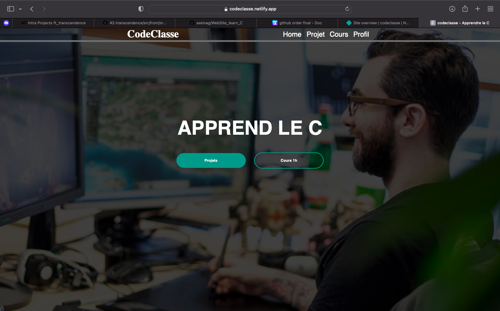
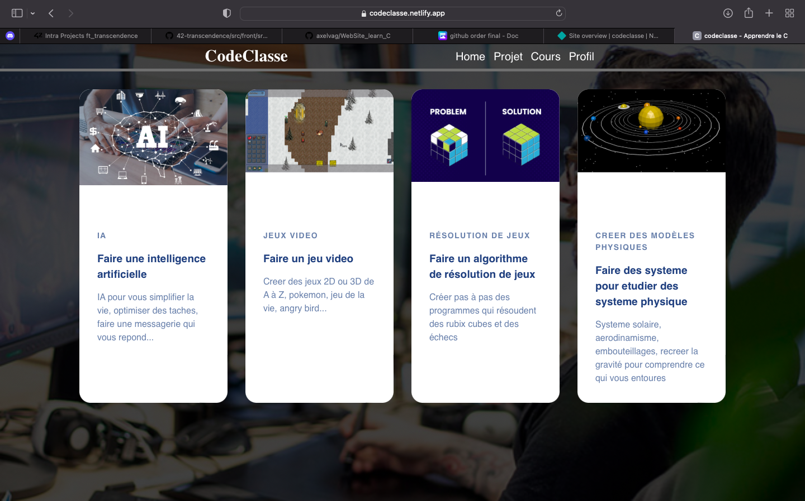
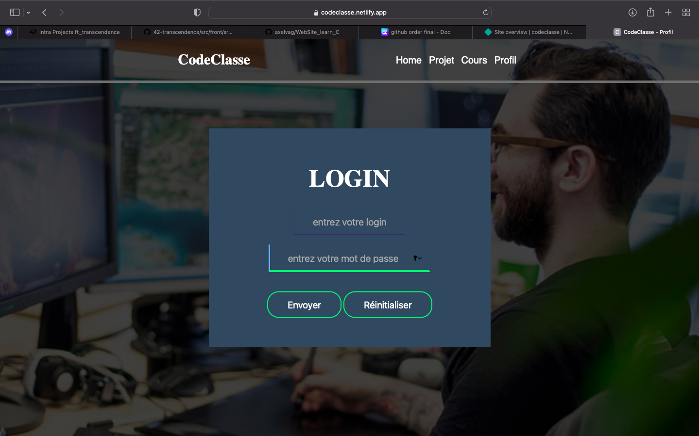
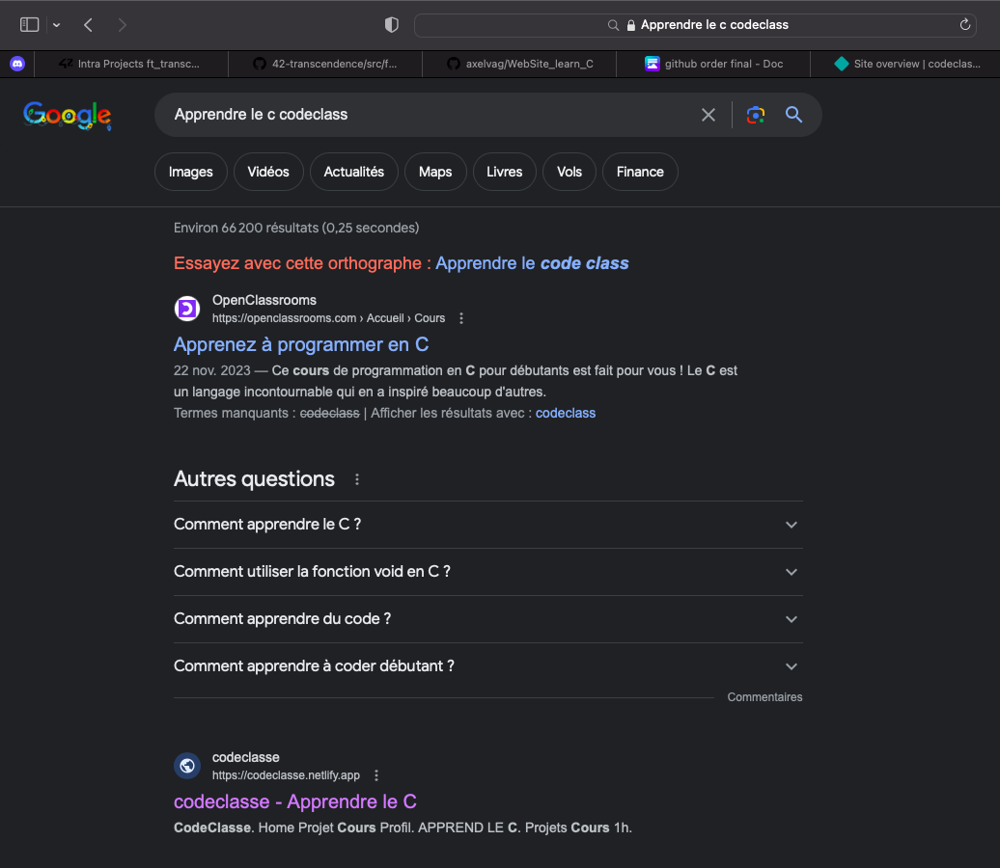

# WebSite_learn_C

> My own commercial Web Site

Welcome to [CodeClass](https://codeclasse.netlify.app)

# Objective

Après avoir bien approfondit les possibilité du language C






J'ai aussi eu a decouvrir le référencement naturel (ou SEO) pour que mon site apparesse dans les premieres possibilité lorsque quelqu'un veut apprendre le C.

Voici le résultat:



On peut voir que j'apparait déjà en deuxieme avec une recherche assez simple et sans avoir pousser le SEO bien loin. Tout cela gratuitement bien sûr car on peut aussi simplement payer google pour qu'il nous reference sans effort.

# Starting

You can see the website [here](https://codeclasse.netlify.app).

Or open folder to access the code Html Css and Php

```bash
# Clone this project
$ git clone https://github.com/axelvag/WebSite_learn_C

# Access
$ cd WebSite_learn_C

# Put it in a php host/manager like 000WebHost, Netlify, Apache or Nginx

# DADAM you have your website online
```
